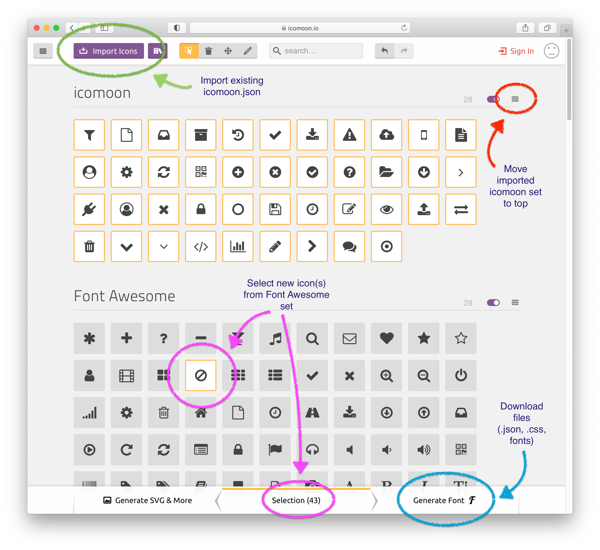
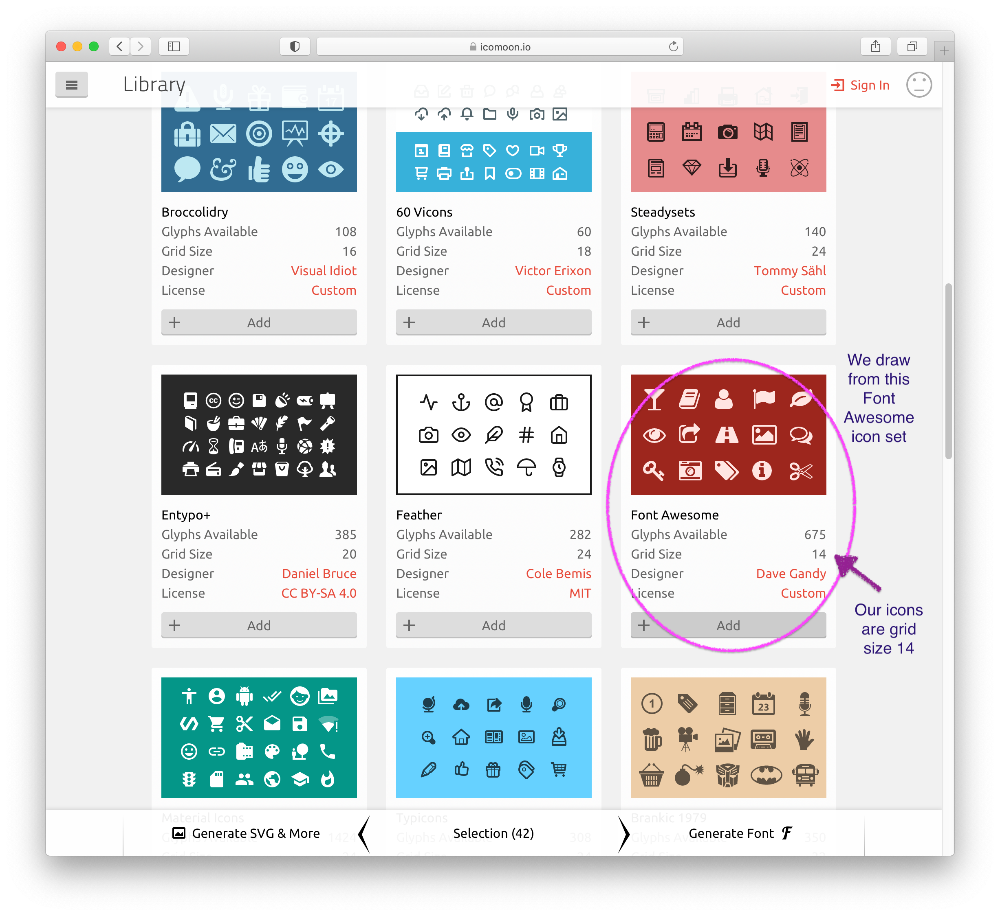

<!--
Copyright 2019 ODK Central Developers
See the NOTICE file at the top-level directory of this distribution and at
https://github.com/getodk/central-frontend/blob/master/NOTICE.

This file is part of ODK Central. It is subject to the license terms in
the LICENSE file found in the top-level directory of this distribution and at
https://www.apache.org/licenses/LICENSE-2.0. No part of ODK Central,
including this file, may be copied, modified, propagated, or distributed
except according to the terms contained in the LICENSE file.
-->
# Contributing to ODK Central Frontend

We want ODK Central Frontend to be easy to use, yet flexible for a wide variety of projects and organizations. To do that, we need your help!

## Questions and Discussion

If you are looking for help, please take a look at the [Documentation Website](https://docs.getodk.org/central-intro/). If that doesn't solve your problem, please head over to the [ODK Forum](https://forum.getodk.org/) and do a search to see if anybody else has had the same problem. If you've identified a new problem, please post on the forum. We prefer forum posts to GitHub issues because more of the community is on the forum.

If you have suggestions about how to improve ODK Central, please share them with us on the [Ideas board](https://forum.getodk.org/c/ideas) of the ODK Forum.

If you are looking for help on how ODK Central works internally or how to update its code, the ODK [developer Slack](https://slack.getodk.org/) is for you.

## Contributing Translations

If you know a language other than English, consider contributing translations through Transifex. For more information, please see the [ODK Central Translation Guide](https://docs.google.com/document/d/1C0MS_ytAEBHwbMkdR-QrtDrWAAh_EkJo2QRr4XyIOpk).

## Contributing Code

### Getting Started

Please see the [readme](https://github.com/getodk/central-frontend#setting-up-your-development-environment) for instructions on how to set up your development environment.

### Guidelines

If you are starting work on a GitHub issue, please leave a comment saying so. If you run into trouble or have to stop working on an issue, please leave a comment as well. If an issue is labeled "needs discussion", additional discussion is needed before work can begin.

Our **code style** is loosely based on the [Airbnb Javascript Style Guide](https://github.com/airbnb/javascript), and you can run `npm run lint` to check your code against it. We do make [some exceptions](/.eslintrc.js) to their rules, and we do make exceptions to the linter when we have a reason and consensus to do so.

As you write code, please try to follow **existing conventions** in the codebase.

We try to **test** as much of our code as possible. To run tests, type `npm run test`. See the section below on [Testing](https://github.com/getodk/central-frontend/blob/master/CONTRIBUTING.md#testing) for more information about our approach to testing.

Please format your **commit messages** as follows:

- Ensure that your first commit line is 72 characters or fewer, and if you include further text in your commit message that there is an empty line following the leading line.
- Please be as descriptive as possible in the 72 characters allowed. This helps us a lot when writing release notes and tracking down regressions.

Once you feel ready to share your progress, please feel free to submit a Pull Request even if you're not quite done. This lets others look over your work and make suggestions before you spend too much time in some particular direction. [Here](https://yangsu.github.io/pull-request-tutorial/) is a great guide on the process of creating a PR.

### Vue

We use Vue.js along with Vue Router, Vuex, and Vue CLI.

### jQuery

ODK Central Frontend uses jQuery in limited ways.

Wherever possible, we try to use Vue instead of jQuery. Vue will not always know about or respect changes that jQuery makes to the DOM, and using jQuery can add complexity to a component.

That said, we make use of some of Bootstrap's jQuery plugins. We may replace those in the future, after which we may be able to remove jQuery. With that in mind, if you have a choice between using jQuery and vanilla JavaScript, consider using the latter. Remember though that as with jQuery, Vue will not always know about or respect changes to the DOM that you make using vanilla JavaScript.

### Bootstrap

ODK Central Frontend uses Bootstrap 3.

Frontend's [global styles](/src/assets/scss/app.scss) override some of Bootstrap's, as do the styles of Frontend components that correspond to a Bootstrap component (for example, `Modal`). However, we tend to stick pretty closely to Bootstrap, and you should be able to use many of Bootstrap's examples with only small changes. If you are creating a new component that is similar to an existing Frontend component, you may find it useful to base the new component off the existing one.

We use a limited number of Bootstrap's jQuery plugins: see the [section above](https://github.com/getodk/central-frontend/blob/master/CONTRIBUTING.md#jquery) on jQuery.

### Global Utilities

We define a number of global utilities as properties on `Vue.prototype`: see [`/src/setup.js`](/src/setup.js). In general, we try to minimize the number of global utilities: do not define a global utility simply to avoid importing to components. However, there are a few occasions in which a global utility may be useful:

- The utility accesses the component using `this` (example: `$alert()`).
- The utility is used in templates, which do not have direct access to imports.
- We mock the utility in testing (examples: `$http`, `$logger`).

If a utility is used in a limited number of components, consider using a mixin instead of defining a global utility.

### HTTP Requests

We use axios to send requests. We set `Vue.prototype.$http` to `axios`, so components can use `this.$http` rather than importing `axios`. That said, components rarely need to access `this.$http` directly. Most of the time, to send a GET request, you can use the [`request` module](/src/store/modules/request.js) of the Vuex store; to send a non-GET request, you can use the [`request` mixin](/src/mixins/request.js). The module and mixin both accept options and complete common tasks like error handling. See the section below on [Response Data](https://github.com/getodk/central-frontend/blob/master/CONTRIBUTING.md#response-data) for more on sending a GET request.

### Learning About a Component

To learn how a given component works, one of the best places to start is how the component communicates with its parent component:

- Does the component have props?
- Does it have slots?
- Does it emit events?

A component can also communicate with other components using the Vuex store. For example, a component may use [response data](https://github.com/getodk/central-frontend/blob/master/CONTRIBUTING.md#response-data) that another component requested.

### Component Names

We specify a name for every component, which facilitates the use of the Vue devtools. In general, we try not to use component names to drive behavior: in most ways, renaming a component should have no effect.

Most components are named according to the combination of a resource and an action or other descriptor, for example, `ProjectEdit` or `FormRow`. The following are common suffixes:

* `List`. A component that lists resources of a particular type. The component often includes a table, an empty table message, text and buttons above the table, and one or more modals.
* `Table`. A table for a particular type of resource. A `Table` component should just be the `<table>` element and should not include an empty table message or other content.
* `Row`. A row of a `*Table` component.
* `Show`. A component that shows a single resource of a particular type.
* `Home`. A parent component of related components, for example, `SystemHome`.
* `Create` (or `New`). A modal used to create a new resource of a particular type.
* `Edit` or `Update`. A component used to update an existing resource of a particular type.
* `Delete`. A modal used to delete an existing resource of a particular type.

### Composables

Each component may use one or more of the composables in [`/src/composables/`](/src/composables/). Most composables will reside in that directory, but if it makes sense to group a composable with other functionality, it may be defined elsewhere. For example, the `useSessions()` composable is defined in [`/src/util/session.js`](/src/util/session.js).

### Router

We support a number of route meta fields, which we document in [`/src/routes.js`](/src/routes.js). The router ([`/src/router.js`](/src/router.js)) contains a fair amount of logic, which is driven largely by the meta fields.

Every navigation is asynchronous. That is most visible for the initial navigation, in part because it tries to restore the session. After the initial navigation, any navigation should be completed almost instantly, as a microtask. That fact should make it easier to reason about navigation. For example, a navigation should never be canceled by a new navigation that takes place before the navigation has completed.

If the user navigates to a location to which the `validateData` meta field forbids access, the user will be redirected to either `/` (if they are logged in) or `/login` (if they are not logged in). That means that unless the user is already at `/` or `/login`, navigating to a different location will always result in some confirmed navigation: either the first navigation will be confirmed, or the redirect will be confirmed. In other words, the user is guaranteed to navigate elsewhere: the route will change.

A navigation can happen at any time. Before the user's session expires, the user will be automatically redirected to `/login`. And in general, the user is permitted to change the route at any time. That means that components should be prepared to be unmounted at any point. For example, if a component starts asynchronous work, it should probably check when that work completes whether the route has changed.

The [`usePath()`](/src/composables/path.js) composable returns router-related functions. Additionally, some router-related utilities are defined in [`/src/util/router.js`](/src/util/router.js).

### Response Data

Use the `get` action of the [`request` module](/src/store/modules/request.js) of the Vuex store to send a GET request. This will store the response data in the Vuex store, as well as complete common tasks like error handling.

The `get` action may transform the response data, for example, by wrapping the data within a presenter object. These transformations are defined in [`/src/store/modules/request/keys.js`](/src/store/modules/request/keys.js). In general, `request/keys.js` defines the specific behavior that the `request` module implements for each type of data.

In some cases, different responses may contradict each other, for example, if responses are returned at different times or if there are concurrent users. Some components will use `watchSyncEffect()` to do what they can to reconcile the data. For example, [`ProjectShow`](/src/components/project/show.vue) uses `watchSyncEffect()` to reconcile `project` and `forms`.

Some routes require certain conditions to be true about the response data. For example, a route might require the user to be able to perform certain verbs. This is implemented using the [`validateData`](/src/routes.js) route meta field.

By default, response data is cleared after the user navigates to a new route. However, exceptions are specified using the [`preserveData`](/src/routes.js) route meta field. For example, as the user navigates between project routes, the response data for the project is preserved: a new request for the project is not sent.

### Alerts

We use the [`Alert`](/src/components/alert.vue) component to render an alert. Only a single alert is shown at a time &mdash; either at the top of the viewport or, if a modal is shown, at the top of the modal. Either way, the data for the alert is stored in the [`alert` object](/src/alert.js) in the container. To display an alert, a component can inject `alert`.

### Internationalization

We use the Vue I18n plugin for internationalization. The plugin is configured in [`/src/i18n.js`](/src/i18n.js) and [`vue.config.js`](/vue.config.js).

ODK Central Frontend uses the translations stored in [`/src/locales/`](/src/locales/): there is a JSON file for each locale. The base name of each file must be a BCP 47 language tag, because we use the name to set the `lang` attribute of the `<html>` element. `en` is the fallback locale, and [`en.json5`](/src/locales/en.json5) is bundled with Frontend; other files are loaded asynchronously as needed. We also make ample use of single file component `i18n` custom blocks.

We also define internationalization-related utilities in [`/src/util/i18n.js`](/src/util/i18n.js).

In general in Frontend, we use kebab-case to name slots. However, when using component interpolation, name slots using camelCase. This seems a little more readable within locale messages. Also, if the slot corresponds to a message, this allows the slot and its message to have the same name.

Note that while Vue I18n supports date/time localization, we use Luxon to manage DateTime objects, including for the limited date/time localization that Frontend implements.

#### Transifex

We use [Transifex](https://www.transifex.com/getodk/central/) to manage our translations. Our Transifex source file, [`/transifex/strings_en.json`](/transifex/strings_en.json), is pulled into Transifex after a commit to the master branch.

`strings_en.json` is formatted as Transifex [Structured JSON](https://docs.transifex.com/formats/json/structured-json). One benefit of Structured JSON is that it supports developer comments. However, Structured JSON is a different format from the JSON that Vue I18n expects.

We use a script to convert Vue I18n JSON to Structured JSON: [`/bin/transifex/restructure.js`](/bin/transifex/restructure.js) reads the Vue I18n JSON in `/src/locales/en.json5` and in single file component `i18n` custom blocks, then converts that JSON to a single Structured JSON file, `strings_en.json`. You can run `restructure.js` via:

```bash
npm run transifex:fix
```

`restructure.js` adds developer comments to `strings_en.json` by reading JSON5 comments. To use JSON5 comments in a single file component, specify `lang="json5"` for the `i18n` custom block. For example:

```html
<i18n lang="json5">
{
  // Some comment about the "hello" message
  // Multiple comments are combined.
  "hello": "Hello, world!",
  // This comment will be added for each of the messages within "fruit".
  "fruit": {
    "apple": "Apple",
    "banana": "Banana"
  }
}
</i18n>
```

Also note about comments:

- You can use comments in `/src/locales/en.json5`, which is parsed as JSON5.
- If you add a comment about a specific key to the top of `/src/locales/en.json5`, that comment will be added for the key whether it appears in `en.json5` or a single file component `i18n` custom block.
- `restructure.js` will automatically generate comments for any message whose path ends with `.full`, because such messages are used for component interpolation.
- Use JSON with comments, but do not use other features of JSON5, which our workflow might not support.

Before each release, we download all translations from Transifex and save them in [`/transifex/`](/transifex/). Transifex allows translations to be downloaded "for use" or "to translate." We use "to translate," because untranslated strings are included as empty strings; "for use" fills in untranslated strings with the source strings, which we would then have to discard. On the website, Transifex allows the translations to be downloaded "to translate" for an individual locale, but not all locales at once. To download all locales at once, run the Transifex CLI in the root directory of the repository:

```bash
tx pull --mode translator --force
```

Once they are downloaded, we convert the Structured JSON files to Vue I18n JSON by running [`/bin/transifex/destructure.js`](/bin/transifex/destructure.js). `destructure.js` generates all locale files in `/src/locales/` other than `en.json5`.

To summarize the workflow:

- Use Vue I18n as you normally would, adding messages to `/src/locales/en.json5` and to single file component `i18n` custom blocks.
- Add any developer comments to the Vue I18n JSON.
- Run `restructure.js` to generate `strings_en.json`.
- `strings_en.json` is automatically pulled into Transifex.
- Before a release, download all translations from Transifex.
- Convert those translations to Vue I18n JSON by running `destructure.js`.

Finally, also note:

- While Vue I18n allows English messages to have three forms (zero, one, multiple), Transifex only allows them to have two (one, other).
- We use a Transifex [translation check](https://docs.transifex.com/translation-checks/setting-translation-checks#checking-for-custom-variables) to ensure that the variables in each English message also appear in the message's translations (and that the translations only use variables that are in the English message).
- For this and [other reasons](https://docs.transifex.com/formats/introduction#plurals), if a message uses a count variable, do not leave it out from the singular form of the message. For example, instead of `"1 apple | {count} apples"`, specify `"{count} apple | {count} apples"`.
- Do not use HTML in messages: use component interpolation instead.

For more background on Transifex, see these articles:

- [Introduction to File Formats](https://docs.transifex.com/formats/introduction)
- [Working with Plurals and Genders](https://docs.transifex.com/localization-tips-workflows/plurals-and-genders)

#### Adding a New Locale

To add a new locale to ODK Central Frontend:

1. Add the locale to Transifex.
2. Add the locale to `locales` in [`/src/i18n.js`](/src/i18n.js) and [`/bin/util/transifex.js`](/bin/util/transifex.js).
3. If the locale pluralizes differently from the default, specify its pluralization rules in `/src/i18n.js`.
4. Check whether there is a [flatpickr localization](https://github.com/flatpickr/flatpickr/tree/master/src/l10n) for the locale. If there is, add it to [`DateRangePicker`](/src/components/date-range-picker.vue). If there isn't, let us know about it in the ODK forum.
5. Consider spot-checking the translations. In particular, check that messages used in component interpolation have been translated correctly.

### Styles

ODK Central Frontend uses Sass.

Frontend implements a set of [global styles](/src/assets/scss/app.scss). Beyond that, we use Vue single file components, so you will find a component's styles in the same file as its HTML and JavaScript.

Frontend does not use Vue scoped CSS. Scoped CSS seems a little ✨magical✨, making it actually harder to reason about components.

Instead of scoped CSS, use `id` and `class` attributes to style components:

- To avoid conflicts, prefix the value of an `id` or `class` attribute with the component's name (in kebab case).
- Do the same for any `class` attribute.
  - The exception to this is if the class is used in combination with an id or with another class that is prefixed with a component's name. For example, if a component named `ProjectOverview` uses a class for some links, the class can be `styled-link` instead of `project-overview-styled-link` if the links are selected as `#project-overview .styled-link`.
- If the root element of a component has an `id` or `class` attribute, its value should be the same as the component's name (in kebab case).

### Assets

#### Icons

We use Font Awesome for our icons, using IcoMoon to select a subset of icons in order to minimize the size. The font files are located in [`/public/fonts/`](/public/fonts/), and the CSS is [`/src/assets/css/icomoon.css`](/src/assets/css/icomoon.css). Our IcoMoon definition is in the root directory at [`/icomoon.json`](/icomoon.json).

To update the icons using the [IcoMoon website](https://icomoon.io/app/):

1. Click the "Import Icons" button in IcoMoon. Select [`icomoon.json`](/icomoon.json). When prompted, load the settings stored in the file.
2. Scroll down to the "Add Icons From Library" link and add Font Awesome.
3. Move the imported set above Font Awesome, using the 3-bar icon to the right of the imported set's title. (This should help preserve the icon order and minimize the diff.)
4. Update the icons by selecting (highlighting) the new icons to add. They don't need to be moved or altered.
5. Download the new font, then copy the files (`icomoon.css`, `fonts/*`, `icomoon.json`) into their locations in the repository.
    * You will need to rename the files and update the paths in the CSS (`fonts/icomoon.ttf?...` becomes `/fonts/icomoon.ttf?...` with a beginning slash).
    * You will need to remove the second class selector in `icomoon.css` line 12 to just read: `[class^="icon-"] {`
    * You will also need to prettify the JSON file to use two space indentation. You can use https://jsonformatter.org/json-pretty-print and choose 2 Tab Space.

By following the steps above, you should minimize the diff. However, in the JSON file, you may still see changes for properties like `id`, `iconIdx`, `setId`, and `setIdx`. (I think these properties may change for the icons that were previously most recently added.)

Here are a few screenshots of the IcoMoon interface from March 2021:




### Standard Actions

Certain actions are standardized across ODK Central Frontend.

#### Standard Button Things

If the user clicks a button that performs a server-side action, then during the request:

* The button should be disabled. Related buttons, such as a cancel button, should also be disabled.
* A spinner should appear within the button.
* If the button is within a modal, then in most cases, the user should not be able to hide the modal.

Once the request completes:

* An alert should be shown indicating the result of the request. The alert should persist on-screen in the case that performing the button's operation also navigates to another page.

You can use `mockHttp().testStandardButton()` to test some of these things for a particular button.

#### Standard Form Things

* When a form is presented to the user, the first enabled field should be focused.
* Each field should have a label.
* For each field, the user should see a clear indication as to whether the field is required.
  * If a field is required, add an asterisk to its label and its placeholder.
* If the user submits a form with an invalid field, the user should be informed about the validation error.
  * If the user resubmits the form, and it is invalid for a different reason, the user should be informed about the new validation error.

### Testing

To run tests, type `npm run test`. This will run all `*.spec.js` files in [`/test/`](/test/).

The core of our tests is the tests of the components and the tests of the router, which together implement most of the business logic. We also have unit tests of composables, the Vuex store, utility functions, and so on. The directory structure of `/test/` largely mirrors that of `/src/`. For example, each test file in `/test/components/` corresponds to a component in `/src/components/`; each test file in `/test/composables/` corresponds to a composable in `/src/composables/`. The exception is that the files in `/test/util/` do not test the files in `/src/util/`, but rather are test utility functions. The files in `/src/util/` are tested by those in `/test/unit/`.

If you add code outside a `.vue` file (for example, a utility function), and it is easy to test in isolation, consider writing unit tests to verify the code. If a function's input is very easy to directly construct or mock, for example, it is likely a good candidate for unit testing. On the other hand, when writing code that is more closely related to other code, it may work best to test the functionality in a component test or a test of the router.

Our tests use a number of external packages:

- Karma, a test runner that we have configured to run tests in Headless Chrome
- Mocha, a test framework
- Chai, for assertions
- Sinon.JS, for spies and stubs
- faker.js, to generate test data
- Vue Test Utils, to test Vue components

`npm run test` runs [`/test/index.js`](/test/index.js), which mocks global utilities and sets up Mocha hooks.

[`/test/assertions.js`](/test/assertions.js) adds Chai helpers.

[Vue Test Utils](https://test-utils.vuejs.org/) renders Vue components for testing, allowing you to test that a component renders and behaves as expected. We have built some functionality on top of Vue Test Utils, in particular [`mount()`](/test/util/lifecycle.js). We define components used only for testing in [`/test/util/components/`](/test/util/components/).

Many tests involve sending a request. You can mock a series of request-response cycles by using `load()` or `mockHttp()`, defined in [`/test/util/http.js`](/test/util/http.js). You can use these to implement common tests, for example, testing some standard button things: see [`/test/util/http/common.js`](/test/util/http/common.js).

As provided by default by Mocha, add `.only` after any `describe()` or `it()` call in the tests to run only the marked tests. For example:

```js
it.only('does something', () => {
  // ...
});
```

#### Test Data

We generate and store test data specific to ODK Central using the [`testData`](/test/data/index.js) object, which uses faker.js. `testData` will persist data until the end of a test and can be thought of as a mock of ODK Central Backend and its database.

`testData` defines a "store" for each Backend resource. For example, `testData.extendedProjects` is a store that generates and stores projects. A store can also be associated with one or more "views," each of which represents a way to format the data and will transform the data in the store. For example, `testData.extendedProjects` is the canonical store of projects, and the objects it generates have extended metadata properties; `testData.standardProjects` is a view onto that store and transforms the objects in the store by removing their extended metadata properties.

Most Backend resources have a `createdAt` property. To generate an object whose `createdAt` property is in the past, use the `createPast()` method of the store or view. To generate an object whose `createdAt` property is set to the current time, use `createNew()`. Most of the time, you will use `createPast()`. For a test that mounts a component, use `createPast()` to set up data that exists before the component is mounted. Use `createNew()` for data created after the component is mounted, for example, after the component sends a POST request. You can pass options to `createPast()` and `createNew()`; each store accepts a different set of options.

To learn more about stores and views, see [`/test/data/data-store.js`](/test/data/data-store.js).


#### E2E Tests

E2E tests can be run using `npm run test:e2e`. These tests assume the full Central stack is running — including central-backend, enketo, pyxform, and postgresql.
By default, tests run against `http://central-dev.localhost:8989`, but you can override it with `--protocol`, `--domain`, and `--port` CLI options.
You can also set a custom `--user` and `--password` from the CLI.
Finally, add the `--ui` flag to run tests in UI mode, which is useful for debugging.
